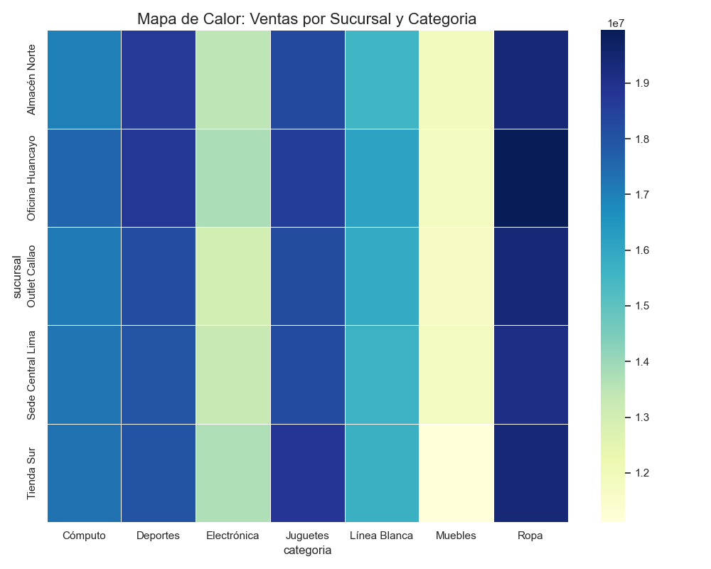
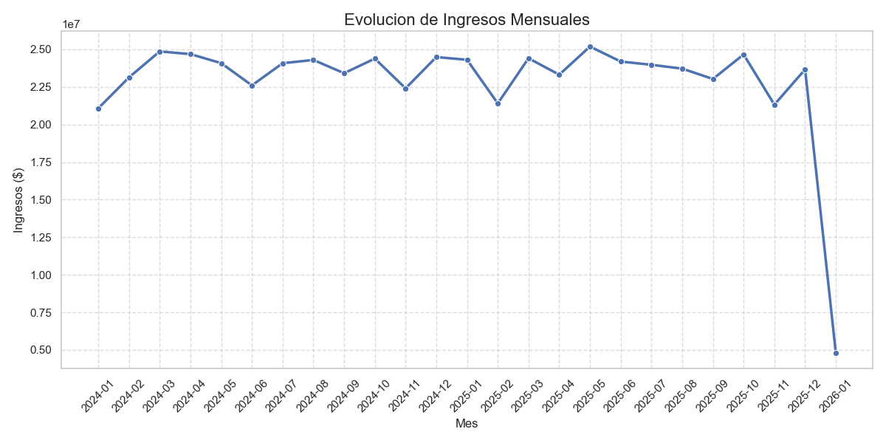
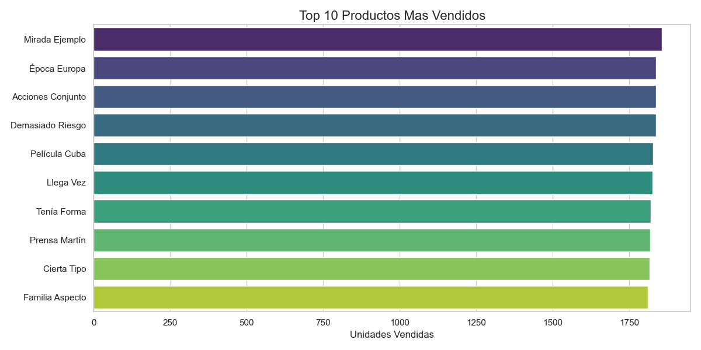

# 🚀 Enterprise ERP Data Warehouse: ETL Pipeline & Advanced Analytics

## 📋 Descripción del Proyecto
Diseño e implementación de una infraestructura de datos completa (Data Warehouse) simulando un entorno de Retail Corporativo a gran escala. El sistema gestiona la ingesta de datos de Logística, Recursos Humanos y Ventas, soportando cargas masivas de información con integridad referencial estricta.

Este proyecto demuestra el ciclo completo de **Ingeniería de Datos**: desde la generación de datos sintéticos y procesos ETL (Extracción, Transformación y Carga) con Python, hasta el modelado relacional complejo, lógica de negocio en backend y visualización de datos.

## 🛠️ Tech Stack & Herramientas
* **Python 3.x:** Orquestación del pipeline, scripts de automatización y visualización.
* **Pandas:** Manipulación de DataFrames y transformación de datos.
* **Matplotlib & Seaborn:** Generación de reportes gráficos y Business Intelligence.
* **MySQL Server 8.0:** Motor de base de datos relacional (RDBMS).
* **SQLAlchemy:** ORM y conector eficiente entre Python y SQL.
* **Faker:** Generación de datos sintéticos (+25,000 transacciones).
* **VS Code & Git:** Entorno de desarrollo y control de versiones.

---

## 🏗️ Arquitectura de Datos

El sistema consta de **10 Tablas Relacionales** bajo un esquema normalizado (Snowflake Schema), diseñado para optimizar tanto la integridad transaccional como las consultas analíticas.

### 🗺️ Diagrama Entidad-Relación (E-R)
Visualización de la arquitectura de la base de datos, mostrando las relaciones entre las tablas de Hechos (`ordenes`, `detalles`) y Dimensiones (`clientes`, `productos`, `sucursales`, etc.).


---

## 🐍 Python Analytics & Visualización
Se desarrolló un módulo de analítica automatizada (`dashboard_analytics.py`) que conecta a la base de datos y genera reportes visuales de alto impacto para la toma de decisiones.

### 📈 Tablero de Control (Business Intelligence)
El script exporta automáticamente los siguientes insights:

**1. Mapa de Calor (Heatmap): Rendimiento por Sede y Categoría**
*Permite identificar rápidamente oportunidades de negocio cruzando variables geográficas y de producto.*


**2. Tendencia de Ingresos y Top Productos**
*Análisis temporal de la facturación y ranking de productos estrella.*
<p float="left">
  
  
</p>

---

## 🧠 Lógica de Negocio Avanzada (Database Backend)
Más allá del almacenamiento, la base de datos actúa como un motor inteligente mediante la implementación de objetos programables:

* **Stored Procedures:** Automatización de reportes complejos (ej. `sp_reporte_ventas_sucursal`) para encapsular lógica repetitiva.
* **Triggers (Disparadores):** Sistema de auditoría en tiempo real (`before_precio_update`) que registra cambios críticos en el historial de precios.
* **User Defined Functions (UDF):** Funciones personalizadas (`obtener_nivel_ventas`) para clasificar empleados o clientes dinámicamente en las consultas.

---

## 📊 Resultados y Analítica SQL

El repositorio incluye scripts SQL (`analisis_avanzado.sql`) que resuelven problemas de negocio reales mediante técnicas avanzadas.

### 🔎 Ejemplo de Consulta: Reporte de Ventas Multidimensional
Consulta que une 7 tablas para calcular métricas financieras por vendedor, sucursal y categoría en tiempo real.


### 📈 Análisis SQL Incluidos:
1.  **Ranking de Rendimiento:** Identificación del "Mejor Vendedor" por cada sucursal usando `DENSE_RANK() OVER (PARTITION BY...)`.
2.  **Principio de Pareto (80/20):** Análisis de los productos que generan el mayor volumen de ingresos.
3.  **Time Intelligence:** Evaluación de tendencias de ventas mensuales para detección de estacionalidad.

---

## 🚀 Cómo ejecutar este proyecto en local

Sigue estos pasos para desplegar el entorno en tu máquina:

1.  **Clonar el repositorio:**
    ```bash
    git clone [https://github.com/pjcordova/enterprise-erp-sql-project.git](https://github.com/pjcordova/enterprise-erp-sql-project.git)
    cd enterprise-erp-sql-project
    ```

2.  **Crear entorno virtual (Recomendado):**
    ```bash
    python -m venv venv
    source venv/bin/activate  # En Windows: venv\Scripts\activate
    ```

3.  **Instalar dependencias:**
    ```bash
    pip install pandas sqlalchemy pymysql faker matplotlib seaborn
    ```

4.  **Configurar Base de Datos:**
    * Asegúrate de tener MySQL corriendo.
    * Edita el archivo `generar_erp.py` con tus credenciales.

5.  **Ejecutar el Pipeline:**
    * **ETL (Carga de Datos):** `python generar_erp.py`
    * **Generar Dashboard:** `python dashboard_analytics.py`

6.  **Explorar:**
    * Abre los archivos `.sql` en MySQL Workbench para probar los procedimientos y consultas.

---

### 👤 Autor
**PIERO CORDOVA**
*Data Engineer & Analyst*
[Enlace a tu LinkedIn](https://www.linkedin.com/in/piero-cordova-cerna-5a9886318)