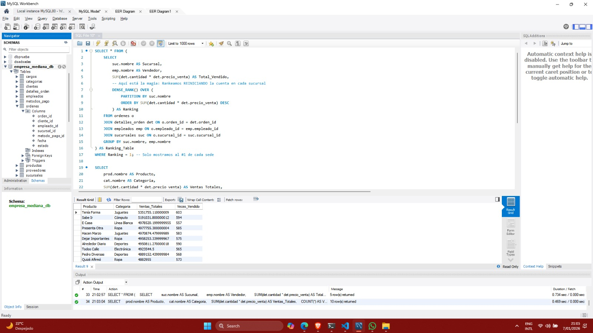

# 🚀 Enterprise ERP Data Warehouse: ETL Pipeline & Advanced SQL Analytics

## 📋 Descripción del Proyecto
Diseño e implementación de una infraestructura de datos completa (Data Warehouse) simulando un entorno de Retail Corporativo a gran escala. El sistema gestiona la ingesta de datos de Logística, Recursos Humanos y Ventas, soportando cargas masivas de información con integridad referencial estricta.

Este proyecto demuestra el ciclo completo de **Ingeniería de Datos**: desde la generación de datos sintéticos y procesos ETL (Extracción, Transformación y Carga) con Python, hasta el modelado relacional complejo y la analítica avanzada en SQL.

## 🛠️ Tech Stack & Herramientas
* **Python 3.x:** Lenguaje principal para la orquestación del pipeline y lógica de negocio.
* **Pandas:** Manipulación de DataFrames y transformación de datos en memoria.
* **MySQL Server 8.0:** Motor de base de datos relacional (RDBMS) para el Data Warehousing.
* **SQLAlchemy:** ORM y conector eficiente entre Python y SQL.
* **Faker:** Generación de datos sintéticos (+25,000 transacciones) simulando escenarios reales.
* **VS Code & Git:** Entorno de desarrollo y control de versiones.

---

## 🏗️ Arquitectura de Datos

El sistema consta de **10 Tablas Relacionales** bajo un esquema normalizado (Snowflake Schema), diseñado para optimizar tanto la integridad transaccional como las consultas analíticas.

### 🗺️ Diagrama Entidad-Relación (E-R)
Visualización de la arquitectura de la base de datos, mostrando las relaciones entre las tablas de Hechos (`ordenes`, `detalles`) y Dimensiones (`clientes`, `productos`, `sucursales`, etc.).


---

## 📊 Resultados y Analítica SQL

El repositorio incluye scripts SQL (`analisis_avanzado.sql`) que resuelven problemas de negocio reales mediante técnicas avanzadas como **Window Functions**, **CTEs** y **Agregaciones Complejas**.

### 🔎 Ejemplo de Consulta: Reporte de Ventas Multidimensional
Consulta que une 7 tablas para calcular métricas financieras por vendedor, sucursal y categoría en tiempo real.



### 📈 Análisis Incluidos en el Proyecto:
1.  **Ranking de Rendimiento:** Identificación del "Mejor Vendedor" por cada sucursal usando `DENSE_RANK() OVER (PARTITION BY...)`.
2.  **Principio de Pareto (80/20):** Análisis de los productos que generan el mayor volumen de ingresos.
3.  **Time Intelligence:** Evaluación de tendencias de ventas mensuales para detección de estacionalidad.

---

## 🚀 Cómo ejecutar este proyecto en local

Sigue estos pasos para desplegar el entorno en tu máquina:

1.  **Clonar el repositorio:**
    ```bash
    git clone [https://github.com/pjcordova/enterprise-erp-sql-project.git](https://github.com/pjcordova/enterprise-erp-sql-project.git)
    cd enterprise-erp-sql-project
    ```

2.  **Crear entorno virtual (Recomendado):**
    ```bash
    python -m venv venv
    source venv/bin/activate  # En Windows: venv\Scripts\activate
    ```

3.  **Instalar dependencias:**
    ```bash
    pip install pandas sqlalchemy pymysql faker
    ```

4.  **Configurar Base de Datos:**
    * Asegúrate de tener MySQL corriendo (XAMPP o MySQL Server).
    * Edita el archivo `generar_erp.py` y actualiza las credenciales si es necesario (usuario/password).

5.  **Ejecutar el Pipeline ETL:**
    ```bash
    python generar_erp.py
    ```
    *Esto creará la base de datos `empresa_mediana_db`, las tablas y cargará +25,000 registros.*

6.  **Analizar:**
    * Abre los archivos `.sql` en MySQL Workbench y ejecuta las consultas.

---
### 👤 Autor
**PIERO CORDOVA**
*Data Engineer & Analyst*
[[Enlace a tu LinkedIn]](https://www.linkedin.com/in/piero-cordova-cerna-5a9886318)
